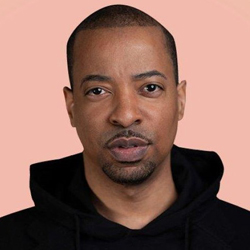

# Personas

## 1. Introdução

Personas são personagens fictícios criados para descrever diferentes tipos de usuários dentro do sistema. A criação de personas tem o objetivo de chegar mais perto do usuário final do produto, dando um direcionamento à equipe.

  
## 2. Personas
### 2.1 José Almeida Camargo

  
<figcaption>Imagem 1: Persona José Almeida Camargo.</figcaption>

- Idade: 46.
- Sexo: Masculino.
- Escolaridade: Ensino Superior Completo.
- Profissão: Designer Gráfico.
- Expectativas: Deseja assistir séries exclusivas, que foram lançadas recentemente.

José tem 46 anos, casado, formado em Design Gráfico e atualmente trabalha em uma empresa focada em edição de vídeos. José mora com sua esposa em um apartamento, e no final de semana eles gostam de assistir séries e filmes que nunca assistiram antes.

  
### 2.2 Cristina Rodrigues

<figcaption>Imagem 2: Persona Cristina Rodrigues.</figcaption>

- Idade: 22.
- Sexo: Feminino.
- Escolaridade: Ensino Superior Incompleto.
- Profissão: Estudante.
- Expectativas: Deseja assistir séries famosas no seu tempo livre.

Cristina tem 22 anos, é solteira, e atualmente está cursando psicologia em uma universidade federal. Ela adora a série Supernatural e sempre que tem uma folga gosta de assistir sozinha em seu quarto.

### 2.3 Juliana Pereira de Jesus

  
<figcaption>Imagem 3: Persona Juliana Pereira de Jesus.</figcaption>

- Idade: 63.
- Sexo: Feminino.
- Escolaridade: Ensino Fundamental Completo.
- Profissão: Dona de casa.
- Expectativas: Deseja assistir filmes e séries.

Juliana tem 63 anos, mora em sua casa no interior, é casada, tem tres filhas. Ela passa o dia cuidando de sua casa, ao final da tarde quando a programação da televisão aberta não lhe agrada ela gosta de procurar por séries e filmes em aplicativos de streaming utilizando sua smartTv.

  
## 3. Antipersona
### 3.1 Divino Borges

<figcaption>Imagem 4: Antipersona Divino Borges.</figcaption>

- Idade: 58.
- Sexo: Masculino.
- Escolaridade: Ensino Superior Completo.
- Profissão: Professor Aposentado.
- Expectativas: Deseja ouvir os seus canais de rádio favoritos.

Divino Borges mora sozinho em sua chácara, que se mudou após muitos anos de trabalho como professor. Divino agora gosta de ouvir seus canais de rádio favoritos durante todo o dia enquanto realiza atividades corriqueiras ou até mesmo quando está descansando na rede no fim da tarde.

  
## 4. Referências
Barbosa, S. D. J.; Silva, B. S. da; Silveira, M. S.; Gasparini, I.; Darin, T.; Barbosa, G. D. J. (2021);Interação Humano-Computador e Experiência do usuário.

Maurício Vianna... [et al.]; Design thinking : inovação em negócios

## 5. Conclusão

Portanto, as personas serão essenciais em etapas do projeto que demandam a visão de um usuário, a técnica de roleplay poderá ser utilizada em conjunto as personas para esse objetivo, isso terá impacto no desenvolvimento, melhoria e verificação/validação de outros artefatos, as personas serão um pilar importante de apoio para o projeto.

## 6. Histórico de Versionamento

|Versão|Data de modificação|Descrição da modificação|Autor|Revisor|
|-|-|-|-|-|
|1.0|19/02/2022|Criação do documento de personas|[Antonio Igor](https://github.com/antonioigorcarvalho) e [Lameque Fernandes](https://github.com/lamequefernandes)|[Caio Santos](https://github.com/caiobsantos)|
|1.1|19/02/2022|Alteração na introdução e adição das referências|[Caio Santos](https://github.com/caiobsantos)|[Sávio Cunha](https://github.com/savioc2)|
|1.2|22/04/2022|Criação do tópico  conclusão do documento|[Erick Levy](https://github.com/ericklevy)| [Antonio Igor](https://github.com/antonioigorcarvalho) |
