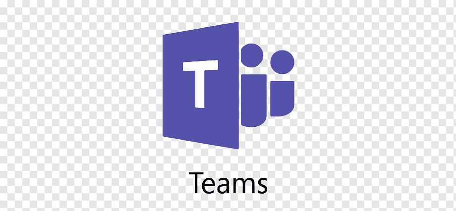

# Ferramentas

## 1. Ferramentas utilizadas

Para melhor organização dos membros no desenvolvimento do projeto, o time decidiu utilizar os seguintes softwares e ferramentas.

| Ferramenta | Nome     | Ação | 
 | :------: | :----------: | :---------------------------------------------------: |
 |  | Discord | Reuniões e discussões da semana |
 |  | Github | Repositorio do projeto |
 |  | Telegram | Utilizado para a Comunicação dos integrantes do grupo |
 |   | Trello | Controle e escolha das tarefas|
 |  | Draw.io | Rich picture e desenhos |
 |  | Teams | Gravações das sprints |
 |  | Figma | Protótipo |
 |  | Visual Studio Code | Produção do projeto |
 |  | Youtube | Apresentações |
 |  | Git | Versionamento |
 |  | Excel | Tabelas |

<figcaption>Tabela 1: Ferramentas utilizadas no projeto</figcaption>

## 2. Conclusão

Nesse sentido  as ferramentas foram essências para desenvolver e melhorar o projeto, para a realização de reuniões, divisão de tarefas, criação de protótipos e do rich picture, além de ajudar criação de artefatos.

## 3. Referências

> **Git, 2022**. Disponível em: <<https://git-scm.com>>. Acesso em: 14 fevereiro 2022.

> **GitHub, 2022**. Disponível em: <<https://github.com/about>>. Acesso em: 14 fevereiro 2022.

> **Telegram, 2022**. Disponível em: <<https://telegram.org/faq#p-o-que-e-telegram-o-que-faco-aqui>>. Acesso em: 14 fevereiro 2022.

> **Trello, 2022**. Disponível em: <<https://trello.com/tour>>. Acesso em: 14 fevereiro 2022.

> **YouTube, 2022**. Disponível em: <<https://about.youtube>>. Acesso em: 14 fevereiro 2022.

> **Figma, 2022**. Disponível em: <<https://www.figma.com/about>>. Acesso em: 14 fevereiro 2022.

> **Microsoft Teams, 2022**. Disponível em: <<https://www.microsoft.com/pt-br/microsoft-teams/group-chat-software>>. Acesso em: 14 fevereiro 2022.

> **Microsoft Excel, 2022**. Disponível em: <<https://www.microsoft.com/pt-br/microsoft-365/excel>>. Acesso em: 14 fevereiro 2022.

> **Visual Studio Code, 2022**. Disponível em: <<https://visualstudio.microsoft.com/pt-br>>. Acesso em: 14 fevereiro 2022.

> **Discord, 2022**. Disponível em: <<https://discord.com/company>>. Acesso em: 14 fevereiro 2022.

> **Draw.io, 2022**.  Disponível em: <<https://drawio-app.com/>. Acesso em: 14 fevereiro 2022.

## 4. Histórico de versionamento

|Versão|Data de modificação|Descrição da modificação|Autor|Revisor|
|-|-|-|-|-|
|1.0|04/02/2022|Criação do documento sobre as ferramentas|[Erick Levy](https://github.com/ericklevy)|[Sávio Cunha](https://github.com/savioc2)|
|1.0.1|05/02/2022|Alteração no titulo e adição do historico de versão|[Lameque Fernandes](https://github.com/lamequefernandes)|[Caio Santos](https://github.com/caiobsantos)|
|1.0.2|19/02/2022|Melhoria na introdução|[Lameque Fernandes](https://github.com/lamequefernandes)|[Caio Santos](https://github.com/caiobsantos)|
|1.0.3|22/04/2022|Criação do tópico  conclusão do documento|[Erick Levy](https://github.com/ericklevy)| [Antonio Igor](https://github.com/antonioigorcarvalho) |
